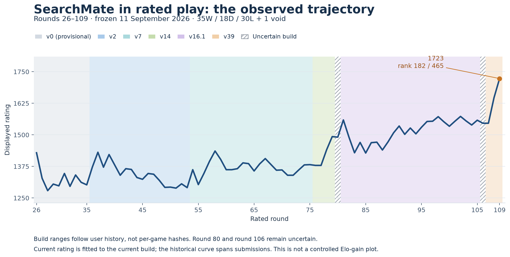

# SearchMate

An original CPU chess engine and a Recuris-inspired research project for [AI Chessathon](https://aichessathon.com/).

**Final submission: internal v39-01, confirmed by the user on 11 September 2026. Engine development is stopped.**

- **[Run the final v39 engine](docs/QUICKSTART_V39.md)** — exact release verification, dependencies and a local API example.
- **[Read the standalone technical report](publication/README.md)** — PDF, editable Word edition and manuscript covering the engine, experiments, competition and lessons learned.
- **[See the completed Swiss results](research/tournament-results/README.md)** — **103rd of 334, 7W/1D/5L and 7.5/13 points**. The qualification goal was not reached.
- **[Download and verify the exact final v39 ZIP](research/releases/final-internal-v39-01/README.md)** — frozen source, weights, endgame assets, hashes and checks.
- **[Browse the research](research/README.md)** — current state, release identities, study chronology, evidence and archived snapshots.
- **[Explore all observed rated rounds, 26–109](research/rated-results/README.md)** — per-round JSON/CSV, attribution limits and the rating timeline.

The standalone report is a project-authored case study, not a peer-reviewed publication. GitHub supplies its evidence companion. The [earlier retrospective](research/RETROSPECTIVE.md) remains the historical pre-Swiss account. [Publication and citation guide](publication/README.md).

## Earlier rated ladder

At the frozen round-109 observation, the profile showed **1723, rank 182 of 465**, and a cumulative **35 wins, 18 draws and 30 losses**; one additional round was void. The first user-attributed v39 results were **2 wins and 1 draw**. The historical graph and cumulative record span submissions. The live rules describe current rating as fitted to the current build; this small latest sample is not a stable Elo estimate or a controlled improvement measurement.

The subsequent 13-round Swiss appears as Final events 110–122. Its displayed rating **1872** and rank **103/334** are separate statistics. Adding those results gives **42W/19D/35L** overall, plus the same void. The Swiss outcomes are public observations; this update does not claim a new PGN/runtime replay audit.

## What the final engine does

V39 combines an original Numba board/search core, PVS, move ordering, history-aware transposition scores, guarded late-move reductions and exact runtime evaluation caching. Its hybrid evaluation adds a bounded correction from our **592-parameter CPU-trained network** to classical material/position scores. It also contains covered queen-versus-king and opposite-colored two-bishop-versus-king tablebase policies and the round-99 fifty-move boundary repair.

Neural experiments started in v29; **v31 trained the particular network retained in v37–v39**. Submitted v16.1 was classical. The model stays fixed during games; the runtime uses no GPU, network access or external engine. [Model card](research/releases/competition-v6-internal-v37-01/MODEL_CARD.md).

| Evidence | Short: 10s + 0.1s | Full: 120s + 0.5s |
|---|---: |---: |
| Historical v37 against exact submitted v16.1 | 12W / 3D / 1L; **13.5/16** | 7W / 1D / 0L; **7.5/8** |
| Final v39 maintenance smoke against v38 | Not a new short strength screen | 0W / 1D / 1L; **0.5/2** |

V39 earned targeted repair qualification. V37's stronger local results belong to that exact predecessor and are not an independently repeated v39 strength campaign. Selected-position improvements and failed experiments are preserved in the [study index](research/studies/README.md). No individual neural contribution, ranking guarantee or causal Recuris benefit is claimed.

## Using this repository

The public API is `get_move(fen: str, time_left_ms: int) -> str`. **Root `agent.py`, `make zip` and generic CI still concern historical v0.** Use the named final archive linked above for v39; it includes the weights and tablebase files needed by that player. Its artifact verifier checks hashes, ZIP contents and syntax without running chess searches.

Historical releases and `harness/` are preserved. Private runtime logs, machine identifiers, bulk training/reference corpora, sealed inputs and unqualified payloads stay local. The public source, model recipe, evidence summaries, selected qualification PGNs and figure data support inspection, but do not form a complete standalone training reproduction bundle.

The starter and license originate from [advitrocks9/aichessathon-starter](https://github.com/advitrocks9/aichessathon-starter); shipped tablebase data carries separate attribution. This repository update documents the final submission; it does not perform an upload or restart development.
