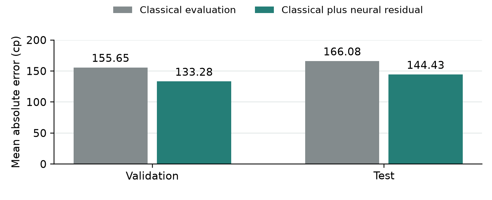

# SearchMate

CPU chess engine development and competition results

SearchMate project | 11 September 2026 | Technical case study

## Abstract

We developed SearchMate for AI Chessathon under a single-core CPU constraint, progressing from a classical Python agent to a compiled search engine with a small original neural evaluation model. The final entry, internal v39, completed the 13-round qualification Swiss with seven wins, one draw and five losses. It scored 7.5 points and placed 103rd among 334 teams. The project did not achieve its qualification goal, but produced several locally qualified engine improvements and a detailed record of unsuccessful alternatives.

The strongest later local result belonged to predecessor v37. Against the exact earlier submitted v16.1, it scored 13.5/16 at short clocks and 7.5/8 at the competition clock. V39 inherited that combined search and neural architecture and added narrowly validated endgame and draw-boundary maintenance. These local results, the final Swiss score and the earlier rating trajectory answer different questions. None isolates the contribution of the neural network or establishes a causal benefit from evolving research memory.

This case study explains the implementation, training and experimental decisions behind the progression. Its main finding is practical: faster search and a better static evaluator became useful through a tested combination, while additional features, deeper search and favorable examples often failed to improve a release screen. The competition outcome gives the engineering work a clear endpoint and leaves specific questions for future study.

### Study setting and evidence

The competition required a Python function returning a legal UCI move from a FEN and remaining clock. At the recorded cutoff, play used one AMD EPYC core at 2.60 GHz, 2 GB of memory, no network or GPU, and 120 seconds plus 0.5 seconds per move. Import had a separate 90-second allowance. Original trained weights and endgame tablebases could be shipped; third-party engines and pretrained chess networks could not. Numba compilation therefore offered a practical route to faster original code [1, 2].

The evidence combines frozen local campaigns, technical checks, bounded reference analysis, supplied PGNs and runtime logs, and public competition results. Internal version numbers identify studies, not automatically successful releases. We retain failed and incomplete experiments, distinguish maintenance checks from competitive screens, and identify uncertain upload boundaries. No new engine training, search or game campaign was performed to write this article [3].

## Technical development

### Establishing a working search engine

The original v0 provided classical material and positional evaluation with depth-limited search. It completed its 120-game setup campaign with 108 wins, ten draws and two losses against the initial baseline opponents. This established useful implementation evidence but did not predict success against later competition entries. SearchMate still suffered tactical losses and repetition draws.

V2 introduced quiescence at ordinary search leaves. Instead of assigning a static score immediately, the engine could continue legal captures, promotions and replies to check. This allowed some apparently favorable captures to be evaluated together with their recaptures. The frontier remained incomplete: a quiet threat can still sit beyond the searched continuation. The source had first failed an internal v1 diagnostic criterion, then passed a separately approved v2 campaign. The later success did not erase the earlier failure.

Against v0, v2 recorded 70 wins, 33 draws and 25 losses in 128 short games, and 21 wins, ten draws and one loss in 32 full-clock games. Subsequent passed-pawn and quiet-check experiments did not qualify. A larger evaluation function or search tree did not automatically improve play [3, 4].

### Compiling the board and search

V7 was the major engineering transition. We built an original Numba core with a numeric 0x88 board, legal move generation, reversible make/unmake operations, evaluation, ordinary search and quiescence. This reduced high-level Python work inside the tree. Python remained at the public request boundary and in independent validation. The initial compiled version retained the preceding evaluation and clock policy, so the experiment primarily concerned the search implementation as a whole.

Principal variation search, or PVS, searches the first well-ordered move with a full alpha-beta window. Later moves receive a narrow probe to determine whether they can improve the current best result. A promising probe receives the appropriate full-window re-search. The saving depends on ordering: a probe is not permission to discard an improving move without confirmation.

The score transposition table also needed semantic safeguards. Its entries carry search depth and exact/lower/upper bounds; mate scores are normalized for distance; incomplete searches do not become exact results. Conservative position and draw-history context limits when scores can be reused. A move hint can assist ordering under weaker conditions only when the hinted move is legal.

Validation included 2,000 seeded legal positions, 34 special fixtures, 53,004 make/unmake checks and 97 shallow move-count comparisons. V7 then scored 20/24 short points and 3.5/4 full-clock points against v2. That qualified the compiled package, not an isolated PVS component [5].

### The last classical submission

Submitted v16.1 remained a classical evaluator. It added killer and history heuristics, legal position-based TT hints, specialized quiescence move generation, adaptive time allocation and bounded reconstruction of between-request game history. The aims were to reach useful cutoffs sooner and retain more relevant draw context from a FEN-only interface. Ambiguity or deadlines can still force history recovery to reset.

V16.1 qualified against v14 with 14/16 short points and 18.5/20 full-clock points. A later v20 also scored well against the older v14, but its direct screen against submitted v16.1 stopped at 1.5/6. That result showed why a replacement must face the current submission: success against an outdated comparator can overstate the practical value of a new package [6].

### Training an original neural residual

Neural experiments began at v29. Its piece-square model had 32 hidden units and 24,640 parameters. Training mean absolute error fell from 177.75 to 31.71 reference centipawns, while validation and test error worsened. This was evidence of poor generalization, not a reason to deploy a highly accurate training fit. V30 reduced the model to eight hidden units and 6,160 parameters with stronger regularization. Its validation and test improvements, about 0.4% and 0.6%, remained below the fixed 2% gate.

V31 changed the representation. It used 36 geometric and material-context features per color, including activity, attacks, pawn structure and advancement, and king pressure or shelter. Shared weights process 72 inputs in own/opponent order from both color perspectives. Eight clipped-ReLU hidden activations per view are combined symmetrically, yielding 592 parameters: 576 input weights, eight hidden biases and eight output weights.

The model supplies a bounded correction of at most 400 centipawns in either direction to the existing classical score. It predicts a static evaluation, not a move. Original float32 weights run through Numba on the CPU. The design is not incremental NNUE and does not use ONNX. Its geometric features are recomputed when needed; a runtime cache stores the engine's own computed evaluations. No reference-engine answer database, pretrained network or GPU enters the submitted player.

CPU fitting used one thread, 80 fixed epochs, AdamW and a group-balanced Huber objective. The training set contained 15,081 training-only labels in 164 opening groups. New validation and test families supplied 678 and 649 usable labels. Whole-family separation reduced opening leakage. Bounded reference searches and filtering approximated suitable static labels, without proving that every accepted position was tactically quiet [7].

| V31 split | Classical MAE cp | Hybrid MAE cp |
|---|---:|---:|
| Training | 172.19 | 148.52 |
| Validation | 155.65 | 133.28 |
| Test | 166.08 | 144.43 |

Figure 1. The retained network reduced group-balanced validation error by 14.37% and test error by 13.04%. These are historical measurements of the frozen v31 model. Reusing the same weights in later candidates did not create additional independent accuracy evidence.

Geometric features make useful interactions easier for a small network to represent, but they still approximate attacks by pinned pieces and omit draw-history context. More accurate leaves can also cost more time to evaluate. V31 itself scored only 3.5/8 short-game points and failed its competitive screen. Static accuracy was therefore necessary evidence for this fit, not sufficient evidence for replacement.

## Experimental evidence

### Combining evaluation and search

The successful v37 retained v31's exact network and combined it with guarded late-move reductions, exact static-evaluation caching, revised iteration forecasting and reversible-history TT context. These mechanisms address different costs. Caching avoids repeated feature evaluation. Ordering and PVS seek early cutoffs. Reduced searches initially spend less work on eligible late quiet moves, but any improving reduced result is confirmed at full depth and receives a wider search when required.

Reduction remains selective. A reduced fail-low can conceal a deeper tactic, so this is not a proof of exhaustive tactical safety. The final engine excludes the earlier null-move experiments. Its iteration forecast changes when another depth is attempted while retaining hard budget limits. The reversible suffix used in score-table context improves reuse without intentionally discarding draw-sensitive history.

V36 passed its short screen but stopped at 4.5/7 full-clock points when the 6/8 requirement became unreachable. V37 then changed the reversible-history context and passed its own fresh opening screens. Because the roots differed and many candidates had been explored, the change in results cannot be attributed to that context change alone [8].

| Candidate and comparator | Short points | Full-clock points |
|---|---:|---:|
| v2 against v0 | 86.5/128 | 26/32 |
| v7 against v2 | 20/24 | 3.5/4 |
| v16.1 against v14 | 14/16 | 18.5/20 |
| v37 against v16.1 | 13.5/16 | 7.5/8 |

Short games used 10 seconds plus 0.1 seconds per move; full-clock games used 120 seconds plus 0.5 seconds. Each row is a different campaign. Samples, openings and selection histories differ, so these are not measurements on a common Elo scale.

Later admission screens normally froze source, opening pairs, colors, runner mode and stopping rules before play. A stage stopped when its required score became mathematically unreachable. This controlled expenditure, but makes the sample a release screen rather than an unbiased estimate of general win rate. Repeated candidate selection further limits statistical inference. The 24 v37 qualification PGNs are preserved for inspection [8].

### Targeted maintenance and the final entry

Round 64 exposed failure to convert queen against bare king. V14 added a narrow Syzygy root selector that examined legal children and used both outcome and distance-to-zeroing information. Winning-outcome-only selection can shuffle indefinitely; distance-based progress was essential. The policy handled mate, stalemate and queen capture explicitly, applied a conservative fifty-move margin and retained safe fallbacks. DTZ was not treated as an exact mate distance.

Four rated or color-mirrored roots were verified against every legal defending reply, covering 289 memoized states. All 61 winning cases among 64 seeded fixtures converted under the stated validation policy. V38 later added covered opposite-colored two-bishop conversion; its four-root traversal covered 515 states, with 51 seeded wins converted and 13 draws preserved [9].

V39 repaired a separate draw-boundary inconsistency. The previous search could return a draw at halfmove 99 before examining a capture or pawn move that resets the counter. The repair searches every legal move at that boundary without stand pat, removes the premature shortcut, and preserves mate priority.

In the round-99 diagnostic before Black's move 111, v38 chose ...Nb4, allowing cxb4, while v39 chose ...Nb6 in both recorded-clock trials. All 19 legal White replies after ...Nb6 reached the actual 100-halfmove boundary without checkmate under the observed referee policy. Matching-history reference estimates were 0 versus -435 centipawns from Black's perspective. The legal continuation check supports the narrow repair more directly than the bounded score estimate alone.

V39's two full-clock smoke games against v38 produced one draw and one loss. The package passed targeted regression and finite import, memory, persistent-request and low-clock checks. It qualified as maintenance, not as a repeated broad strength screen. Its neural file remained unchanged from v31. Later studies through v48 did not produce a qualifying replacement, and v39 became the final submitted entry [9].

### Why unsuccessful studies mattered

A seven-coefficient classical fit in v12 improved static metrics but failed its original decision gate; a separately defined game study of the unchanged source stopped at 2.5/7. V13 changed the selected round-59 recapture but stopped at 4/9. A quiet-check extension in v15 scored 0.5/5. Late v48 improved a selected round-103 reference estimate by about 691 centipawns but scored only 4.5/9. These failures constrain the claims that can be made about the successful build.

## Competition results

### The rated ladder

The recorded ladder spans rated rounds 26 through 109, including one void at round 30. Its 83 scored games yielded 35 wins, 18 draws and 30 losses, or 44 points. The saved end-of-ladder profile showed rating 1723 and rank 182 among 465 entries. The rating graph and cumulative record span submissions; the rules describe live rating as fitted to the current build. A visible jump after a few new-build games cannot be interpreted as a controlled Elo gain [1, 10].

Submission history attributes rounds 54-75 to v7, 76-79 to v14, 81-105 to v16.1 and 107-109 to v39. Round 80 remains uncertain between v14 and v16.1; round 106 remains unassigned. No per-game source hash is visible. V39's first three user-attributed rated games yielded two wins and one draw. Some older games have replay-verified PGN/log pairs, while later public-only observations have weaker evidence coverage.

### The final Swiss

The locked-build qualification Swiss followed the ladder. SearchMate's 13 games are displayed as Final 110 through Final 122, corresponding to Swiss rounds 1-13. The final standings show 103rd place among 334 teams, 7.5 points, Buchholz 90.0 and a displayed Swiss rating of 1872. That Swiss display should not be substituted into the earlier ladder graph. The profile's cumulative record after the Swiss became 42 wins, 19 draws and 35 losses, consistent with adding seven wins, one draw and five losses to the ladder totals [11].

| Swiss round | Opponent | Color and result |
|---|---|---|
| 1 | The Aura Farmers | White win |
| 2 | xx | Black loss |
| 3 | neomatica | White win |
| 4 | zenith | Black loss |
| 5 | Grilled Liver | White win |
| 6 | MeshPotato | Black loss |
| 7 | Johnny's Sins | White win |
| 8 | The Sandbox | Black loss |
| 9 | murmp | White win |
| 10 | Kaamuli | Black draw |
| 11 | APEX | White win |
| 12 | igamerboii | Black loss |
| 13 | OnlyBlunder | Black win |

The final score was 57.7% of available points, and the placing was approximately the top 31% of the Swiss field. The participant reports not qualifying for the London stage. The published capacity was 50 people rather than an exact top-50-team cutoff, so the placement alone should not be converted into a precise invitation rule.

The color split is striking: six wins in six White games, compared with one win, one draw and five losses in seven Black games. This supplies a useful future question about defenses and opening contexts. It does not establish a color-specific implementation bug because opponents and openings differed. This article records public results, not a newly completed PGN/runtime audit of those Swiss games.

## Discussion

### What the project demonstrated

SearchMate achieved useful local progress without GPU training or a third-party chess engine. Its compiled core and later hybrid package passed direct screens against their relevant predecessors. Narrow endgame and draw-boundary repairs also supported more specific correctness claims. The final Swiss score shows a functioning entry winning games against an external field, even though it did not reach the desired qualification position.

The network's role is understandable but not isolated experimentally. It supplies a learned correction at searched leaves; the search explores consequences outside those static features. V31's failed games show that improved label accuracy alone was insufficient. V37's successful combined build is evidence for that package under its frozen screens. A matched ablation holding search and clocks fixed would be needed to estimate the network's own competitive contribution.

The competition also exposed limits in our development strategy. We sometimes invested heavily in a selected disagreement before its broader relevance was established. Numerous variants raised the risk of selecting favorable samples. Short screens saved time but were noisy, while long campaigns could delay the next useful question. Future work should allocate more effort to a small number of well-supported mechanisms and independent assessments, with an explicit allowance for inconclusive outcomes.

Budget diagnoses did not establish a general fix from longer searches. One forecast study repaired a selected continuation, illustrating why time-allocation changes still needed position-specific evidence and game qualification.

### Research memory and learning from the process

The Recuris-inspired component was an evidence and decision record. It was distinct from transposition/history state within a game and from fixed neural weights. The deployed agent did not revise its own code or learn new weights after a win.

Three admitted process lessons shaped later work. M1-P001 addressed local startup cost: imports consumed about 69.6% of a completed 58-game Windows screen, motivating verified warmed workers for short games while retaining fresh-process full-clock and package checks. M1-P002 separated proxy improvements from game qualification and preserved failed samples. M1-P003 required completed traces and comparable reference estimates before assigning a loss to a single subsystem [12].

These records demonstrate that lessons were captured and applied. They do not establish that an evolving-memory researcher outperformed an otherwise equivalent researcher with fixed memory. That would require a separate controlled study with equal budgets, isolated information and predefined outcomes. A rising graph and a version number are not substitutes for that comparison.

### Participation and remaining limitations

Missing the qualification goal is a real competitive shortfall. It can coexist with a successful learning project. We ended with an original engine, a CPU training and deployment pipeline, verifiable release identities, and a record that explains why several attractive ideas were rejected. Preserving that evidence makes the experience more valuable than presenting only the final wins.

The publication contribution is a constrained engineering case study connecting implementation cost, static accuracy, search decisions and competition outcomes. The mistakes, including overfitting and overinterpreting favorable examples, are part of that contribution. Autonomous recursive self-improvement remains unproven.

Remaining engine questions include king safety, longer quiet tactical threats, the unresolved round-103 continuation, uncovered endings, imperfect history reconstruction and low-clock fallbacks. Local tests do not prove every-clock safety. The Swiss color split is a new diagnostic lead, not a retrospective explanation of all five losses. No additional development is implied by this article.

### Reproducibility and publication status

The companion repository preserves exact submitted source, original weights, tablebase attribution, model recipe and metrics, selected qualification PGNs, rated and Swiss result inventories, and figure data. Historical studies and failed outcomes remain distinguishable from current release status. Private runtime logs, bulk training/reference corpora and unqualified payloads remain local, so the public materials are not a complete standalone reproduction of every training experiment.

This project-authored report was prepared with AI assistance in coding, analysis and writing. It is not peer reviewed. The final v39 release preserves SHA-256 identities and a verification procedure, linking the account to the exact submitted artifacts.

## References

[1] AI Chessathon. Competition rules. Retrieved 11 September 2026. https://aichessathon.com/docs/rules.md

[2] AI Chessathon. Agent contract. Retrieved 11 September 2026. https://aichessathon.com/docs/agent-contract.md

[3] SearchMate project. Research retrospective and study chronology. 2026. Companion repository: https://github.com/Fallenprogram/SearchMate-algo

[4] SearchMate project. V0 campaign and v2 release evidence. 2026. Repository directories research/runs/v0-01 and research/releases/v2-01.

[5] SearchMate project. Original compiled CPU core qualification. 2026. Repository directory research/releases/competition-v3-internal-v7-01.

[6] SearchMate project. Submitted v16.1 release and 10 September progress review. 2026. Repository directory research/releases/competition-v5-internal-v16-01 and research/PROGRESS_2026-09-10.md.

[7] SearchMate project. Original CPU neural residual model card, training recipe and frozen accuracy. 2026. Repository directory research/releases/competition-v6-internal-v37-01.

[8] SearchMate project. V37 frozen qualification evidence and 24 game records. 2026. Same release directory as reference 7; games.json and evidence-summary.json.

[9] SearchMate project. KQK maintenance evidence and final v39 release. 2026. Repository directories research/releases/competition-v4-internal-v14-01 and research/releases/final-internal-v39-01.

[10] AI Chessathon and SearchMate project. Rated rounds 26-109 inventory. 2026. Repository file research/rated-results/rated-results-26-109.json.

[11] AI Chessathon. Final qualification leaderboard after Swiss round 13, and RSI team game results. Retrieved 11 September 2026. https://aichessathon.com/leaderboard?stage=final

[12] SearchMate project. Evidence-reviewed process memory M1-P001 through M1-P003. 2026. Repository file research/EXPERIENTIAL_MEMORY.md.
