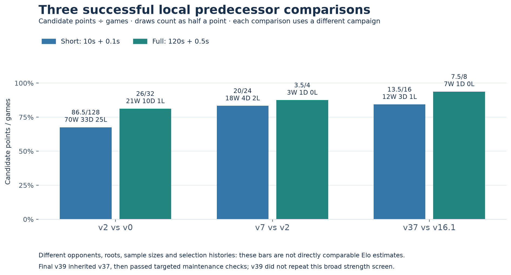
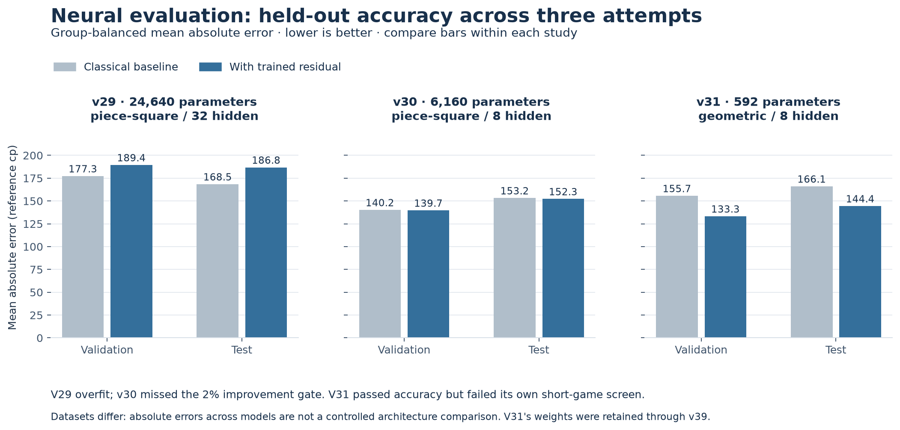
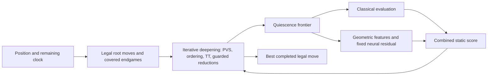

# SearchMate: improving a CPU chess engine through measured iteration

*A technical case study of classical search, an original neural residual, and evidence-driven maintenance*

SearchMate project · 11 September 2026 · Evidence cutoff: rated round 109

## Abstract

SearchMate began as a classical Python chess agent and ended this development window as a Numba-compiled engine with a small, original CPU-trained neural correction, selective search, and narrowly verified endgame policies. Three changes have particularly useful local evidence: the v2 search revision outscored v0; the v7 compiled core outscored v2; and the later v37 combined neural-and-search build outscored submitted v16.1 in both short and competition-clock screens. Several seemingly promising intervening changes failed their game criteria. Better evaluation accuracy, a deeper search, and a repaired example were repeatedly insufficient to justify replacement.

The final submitted v39 inherited v37 and added two maintenance changes: covered two-bishop conversion and a fifty-move decision-boundary repair. V39 was qualified for those repairs, not through another broad strength campaign. Its first user-attributed rated results were two wins and one draw. Across the complete observed ladder history, 83 scored games produced 35 wins, 18 draws and 30 losses; one further round was void. These observations are encouraging but do not isolate a neural-network effect, establish a fixed Elo improvement, or demonstrate a causal benefit from Recuris-inspired research memory. This report explains what changed, what was measured, where the process failed, and which weaknesses remained when development stopped.

## 1. The problem and the evidence

The competition required an agent exposing `get_move(fen, time_left_ms) -> str`. At the recorded cutoff, the contract specified one AMD EPYC CPU core, 2 GB of memory, no runtime GPU or network, a 90-second import allowance, and 120 seconds plus 0.5 seconds per move. Own trained weights could be shipped; a published engine or pretrained chess network could not. These constraints made fast original Python/Numba code and inexpensive CPU inference practical targets. The [canonical agent contract](https://aichessathon.com/docs/agent-contract.md) and [rules](https://aichessathon.com/docs/rules.md) are live documents; this is a dated account, not a promise that their future wording will match it.

Development combined user direction, AI-assisted implementation and analysis, local reference estimates, and supplied rated PGNs/runtime logs. Internal version numbers identify experiments, not a sequence of deployed improvements. A failed v12, for example, did not replace v7. Likewise, a package directory labelled “competition v6” does not by itself establish which build played a queued game. The [release index](releases/README.md) separates archive names from submission history.

Four kinds of evidence answer different questions:

| Evidence | What it supports | What it cannot establish alone |
|---|---|---|
| Legal-move, restoration, import and package checks | Correctness on the checked inputs and local environment | Strong chess or safety on every clock/platform |
| Fixed-depth traces, costs and bounded reference estimates | A particular mechanism or decision disagreement | Whole-game benefit or an exact position value |
| Frozen local game screens against an exact predecessor | Performance in that sample, at that clock and opening set | A general Elo gain or the effect of one component in a bundle |
| Rated ladder matches | Behavior against other submitted agents under the platform | A controlled comparison across versions or research methods |

Later strength screens normally froze source hashes, openings, colors, clocks, runner mode and stopping rules. The short and full stages were separate requirements; a stage stopped when its points threshold became unreachable. Such stopping avoids spending time on a failed admission attempt, but makes the result a release screen rather than an unbiased win-rate estimate. Many candidates were explored, sometimes on previously exposed development material. Consequently, results are not pooled into a significance claim. Maintenance releases used explicit technical/conversion criteria and clean smoke games instead of the broader 75% points gates.

## 2. From Python search to the compiled core

The original v0 established a working agent and test process. It finished its 120-game setup campaign with 108 wins, ten draws and two losses against the campaign's baseline opponents. That result should not be compared directly with later screens against much stronger SearchMate versions. The baseline itself still showed repetition and tactical weaknesses. [Original campaign report](runs/v0-01/REPORT.md).

The next important revision strengthened quiescence search: ordinary depth-limited search no longer treated every leaf as a settled static position. Captures, promotions and required check evasions could continue until a more suitable frontier. This reduces some horizon errors, such as evaluating a capture before the recapture. It does not make the frontier tactically complete. The initial internal v1 admission attempt failed a selected-position criterion; the same source subsequently entered a separately approved v2 campaign. That distinction is retained rather than rewriting the earlier failure as a pass.

V2's local head-to-head record against v0 was 70W/33D/25L over 128 short games and 21W/10D/1L over 32 full-clock games. It qualified and was submitted. Yet rated play still exposed pawn defense, king safety and conversion problems. Adding a passed-pawn term in v3 and quiet checking moves in v4 did not produce qualifying competitive gains. V3 scored 61.5/128 and v4 60/128 in their recorded head-to-head short portions. More chess knowledge in an evaluator or a larger search tree was not automatically better play. [8 September review](PROGRESS_2026-09-08.md).

The major engineering advance was v7. It replaced expensive Python-level search machinery with an original numeric board and search core compiled by Numba. A 0x88 board representation makes off-board detection inexpensive; make/unmake updates a position reversibly; compiled legal generation, evaluation, ordinary search and quiescence avoid repeated high-level object work at each node. Python still provided the public interface and referee-side checks. The purpose was to search useful continuations within the same clock policy, while initially retaining the existing evaluation.

V7 used principal variation search, or PVS. The first well-ordered move receives a full alpha–beta window. Later moves are initially tested with a narrow window to see whether they can improve the current best score. A promising probe is searched again with the required wider window. This can save work when ordering is good; it is not permission to discard an improving move without confirmation. Its transposition table stored search depth and score bounds, handled mate distance, and used conservative draw-history context. Aborted work could not masquerade as a completed exact result.

Validation covered 2,000 seeded legal positions, 34 special fixtures, 53,004 make/unmake checks, 97 shallow move-count comparisons and 17 fixed-depth cases. V7 then scored 18W/4D/2L against v2 in 24 short games and 3W/1D/0L in four full-clock games. This qualified the compiled package as a whole; it was not an isolated PVS ablation. The earlier PVS-only v6 bridge had been interrupted by a runner failure before scored games. [V7 release and evidence](releases/competition-v3-internal-v7-01/README.md).

*Figure 1. Each pair of bars belongs to a different frozen candidate/comparator campaign. Short and full-clock samples remain separate. These percentages do not rank the campaigns on a common Elo scale.*

## 3. Why the middle experiments did not qualify

Some rated losses ended with substantial clock time remaining. That made time allocation a sensible question, but it did not demonstrate that simply allowing longer searches would repair them. A bounded v2 diagnosis compared ordinary, three-second and six-second searches on a fixed set. The required stable gains and complete controls were not obtained. A later unchanged-v7 time study also failed to establish the intended decision improvements. Missing comparisons remained unknown; neither study justified the conclusion that evaluation must be the sole cause.

Reference analysis did expose concrete disagreements. In round 59, for example, the historical `fxe3` preference was approximately 244 reference centipawns worse than `Qxe3` under the recorded estimate. But a reference engine's preferred alternative does not explain why SearchMate chose its move. Later traces investigated completed continuations, score bounds, draw context and evaluation instead of treating disagreement as proof of one faulty subsystem.

V12 fitted seven bounded classical correction weights on the CPU: knight, bishop, rook and queen activity; king pressure; isolated pawns; and doubled pawns. The resulting integer coefficients were **12/12/5/4/24/0/15**. This was parameter fitting, not a neural network. Its static-accuracy checks passed, but the first attempt failed its targeted decision gate. A separately defined game study of the unchanged candidate scored 1W/3D/3L, or 2.5/7, before 12/16 became unreachable. V13 narrowed the idea to the doubled-pawn penalty and changed the selected round-59 move, but scored 4W/0D/5L. Neither became a submission.

The same lesson appeared in search optimization. V9 had useful node savings; later practical game screens did not qualify it. V11 had an initially favorable tiny full-clock sample, followed by a separately retained failed confirmation. V15's bounded quiet-check quiescence extension was technically plausible but scored 0W/1D/4L against v14. Searching extra checks consumes time and can reduce completed ordinary depth; selective tactical coverage must pay for that cost in actual decisions and games.

This work also exposed a process problem: cold imports dominated the Windows short-game campaign cost. Across the completed 58-game v9–v11 window, startup accounted for about 69.6% of elapsed time. Source-specific warmed workers were subsequently used only after reset equivalence checks; full-clock and exact-package checks retained fresh processes. The saving concerned local experiment throughput, not a demonstrated increase in the platform agent's playing strength. The [study index](studies/README.md) records unsuccessful and incomplete attempts separately.

## 4. Repairing conversion, then improving classical search

Round 64 supplied a different kind of problem. V7 failed to convert a queen against a bare king. In this exact material class, a narrow tablebase policy could be checked much more directly than a general positional term.

V14 added a root selector for exactly two kings and one queen. It examined legal children, recognized mate, stalemate and queen capture, and used Syzygy outcome and distance-to-zeroing information to choose progress-preserving moves. Selecting any winning-outcome move would be insufficient: an engine can shuffle forever among theoretically won positions. The selector therefore used distance, with conservative fifty-move margins and fallback behavior. DTZ was not described as an exact mate distance.

Four rated/color-mirrored roots were verified against every legal defending reply, covering 289 memoized states. Of 64 additional seeded cases, all 61 winning cases converted under the specified validation policy. Two full-clock smoke games against v7 drew cleanly. This justified a covered-endgame repair, not a large strength claim. The later rounds 76–90 contained no exact KQK position, so their results do not validate the repair in tournament play. [V14 evidence](releases/competition-v4-internal-v14-01/README.md).

The next broadly qualified submission, **v16.1/internal v16-01**, remained classical. It improved ordinary move ordering with killer and history heuristics, used legal position-based TT move hints, specialized quiescence move generation, adapted clock allocation, and attempted bounded recovery of game history between FEN-only requests. These mechanisms aim to find useful cutoffs sooner and avoid mistaking a history-free repeated position for a new one. Recovery is imperfect: deadlines or ambiguity can force a reset, and recognizing repetition does not prove a draw was avoidable.

Against v14, v16 scored **13W/2D/1L, 14/16 points** short and **17W/3D/0L, 18.5/20** full-clock. V20 later scored well against that same older v14 baseline, but its direct screen against the actual submitted v16.1 scored **0W/3D/3L, 1.5/6**, making the new requirement unreachable. This was a practical warning against using an outdated comparator to recommend a replacement. V20's payload remained unpublished. [V16 release](releases/competition-v5-internal-v16-01/README.md), [10 September review](PROGRESS_2026-09-10.md).

## 5. What the neural network actually added

**Neural experiments began at v29. V31 introduced the particular network retained in v37 and v39.** Earlier wording that called v31 the first neural experiment conflated those milestones. V16.1 contained no trained neural network.

The first two neural approaches were informative failures. V29 used piece-square inputs and 32 hidden units, with 24,640 parameters. Its training error dropped dramatically, while validation and test error worsened: the model fit its training distribution without useful held-out improvement. V30 reduced the network to eight hidden units and 6,160 parameters with stronger regularization. Its held-out improvements were only about 0.4% and 0.6%, below the fixed 2% criterion. Neither proceeded to a qualifying game campaign.

V31 changed the representation. Instead of asking a small network to infer useful relations from piece-square occupancy alone, it supplied **36 geometric/context features per color**, covering activity and attacks, pawn structure and advancement, king pressure/shelter, and piece/material context. Each view receives 72 inputs with own/opponent ordering. A shared eight-unit clipped-ReLU layer is evaluated from both color perspectives; the outputs are subtracted to enforce color symmetry. The resulting **592 trained parameters** comprise 576 input weights, eight hidden biases and eight output weights.

The network predicts a correction, not a move. Its output is bounded to ±400 centipawns, rounded, and added to the existing classical evaluation with the correct side-to-move sign. Classical material and positional terms remain. This is a compact hybrid evaluator with original float32 weights and Numba inference. It is neither an incremental NNUE implementation nor an ONNX deployment. There was no GPU training, pretrained network, runtime reference-engine call or automatic learning from rated results.

Training used one CPU thread, 80 fixed epochs, a fixed seed, AdamW and a group-balanced Huber objective. The v31 training set reused 15,081 training-only labels from 164 opening groups. Validation and test used new opening families, with 678 and 649 usable labels. The labels came from bounded offline reference searches and acceptance filters that approximate quiet static positions. They are not mathematical truth, and the filters do not guarantee tactical quietness. Whole-family partitioning reduces opening leakage; it does not make every future tournament position in-distribution.

| Historical v31 split | Labels / groups | Classical MAE | Hybrid MAE | Reduction |
|---|---:|---:|---:|---:|
| Training | 15,081 / 164 | 172.19 cp | 148.52 cp | 13.74% |
| Validation | 678 / 12 | 155.65 cp | 133.28 cp | 14.37% |
| Test | 649 / 12 | 166.08 cp | 144.43 cp | 13.04% |

*Figure 2. Within each model's own split, compare the hybrid evaluator with its classical baseline. The datasets differ between studies, so absolute errors across v29/v30/v31 are not a controlled architecture comparison. V31's later reuse provides no new independent accuracy sample.*

The representation plausibly helps by expressing interactions: activity may matter differently with exposed kings or different material. The measured claim is narrower: v31 reduced group-balanced error on its frozen held-out labels. The features still approximate pinned-piece attacks and omit castling, en-passant and draw-history context. A better static estimate can also cost time per leaf and does not guarantee a better minimax choice. Indeed, **v31 itself scored only 3W/1D/4L, 3.5/8 points**, and failed its short-game screen. [Model card, recipe, accuracy and provenance](releases/competition-v6-internal-v37-01/MODEL_CARD.md).

## 6. Making the evaluator and search work together

The eventual v37 combined build retained v31's exact weights while addressing how search used its available time. Its main mechanisms were:

- **Guarded late-move reductions.** Late, low-priority quiet moves at eligible non-principal nodes receive an initial one-ply reduction. A result improving alpha is confirmed at full depth, followed by a wider PVS search when required. Captures, promotions, check situations and selected high-priority moves are excluded by the guards. This remains selective search: an unpromising reduced result can hide a deeper tactic. The final engine does not include the earlier null-move experiments.
- **Exact static-evaluation caching.** A verified position identity allows reuse of the player's own computed static evaluation. This reduces repeated feature/network work; no shipped database of reference-engine answers is consulted.
- **Iteration forecasting.** A conservative forecast had prevented another useful iteration in a diagnosed position. The forecast multiplier changed while the hard/soft budget limits remained intact. This helps only when the additional iteration completes useful work; longer time by itself had not repaired other targets.
- **Reversible-history TT context.** The score-table context uses the relevant reversible history suffix rather than carrying irrelevant earlier history. This can permit reuse without erasing draw-sensitive context. It does not make FEN-only history recovery perfect.

V36, containing the preceding combination, passed short qualification at 12/16 but stopped at 4.5/7 full-clock points because 6/8 was unreachable. V37 then changed the reversible-history context and entered its own frozen opening screens: **12W/3D/1L, 13.5/16 short**, and **7W/1D/0L, 7.5/8 full** against exact submitted v16.1, with zero recorded faults. This is the strongest direct local evidence for the later hybrid package. However, differing roots, candidate selection and component interactions prevent assigning its gain to the network, TT change or any one mechanism independently. The [24 public qualification PGNs](releases/competition-v6-internal-v37-01/games.json) make the actual sample inspectable.

The network gives search a more informed estimate at some leaves; search examines consequences the static model cannot know. Neither replaces the other. A trained score cannot directly resolve a forcing combination beyond the searched horizon, while more search built on misleading leaf preferences can still choose badly.

## 7. Why the final submission was v39

V38 added covered opposite-colored two-bishop-versus-king conversion with the necessary Syzygy assets. Its four-root traversal covered 515 states; 51 seeded winning cases converted and 13 draws were preserved. Two full-clock smoke games against v37 were clean wins. These finite checks supported the maintenance policy, not a general win-rate claim.

V39 repaired an actual decision-boundary inconsistency. The previous search could declare a draw at halfmove 99 before examining a capture or pawn move that resets the counter. At that boundary, the repaired quiescence examines every legal move without stand pat; the premature ordinary-search shortcut is removed, and root handling tests a reached fifty-move boundary with mate priority.

In the round-99 position before Black's move 111, v38 chose `...Nb4`, allowing `cxb4`; v39 chose `...Nb6` in both recorded-clock trials. All 19 legal White replies after `...Nb6` reach the actual 100-halfmove boundary without checkmate under the observed referee policy. Matched-history reference estimates were 0 versus −435 cp from Black's perspective. The legal boundary check is stronger evidence for this narrow explanation than the bounded reference score alone. Historical ambiguity about prospective claims versus reached-boundary adjudication is still documented.

V39 preserved ordinary fixed-depth comparisons and passed targeted boundary, restoration, asset and package checks. Its two full-clock smoke games against v38 scored **0W/1D/1L**. That weaker result is retained: v39 was accepted as targeted maintenance, not as a fresh 75%-screen strength champion. Its exact-package cold import was 27.93 seconds, with 256.6 MiB peak local job memory; the finite persistent and low-clock checks passed. These timings are local measurements, not platform-wide guarantees. [Exact final source, ZIP, hashes and evidence](releases/final-internal-v39-01/README.md).

Late experiments remained unsuccessful. Some extensions altered targeted decisions but failed games; a wider neural model failed its accuracy criterion. V48 improved a round-103 selected child estimate by approximately 691 cp yet scored only 3W/3D/3L, 4.5/9, before its short threshold became unreachable. It was not included. The user confirmed v39 as final and stopped development. Round 103, general king safety, longer quiet threats, uncovered endings and imperfect history reconstruction remain unresolved. [Closed final window](FINAL_SUBMISSION_2026-09-11.md).

## 8. What happened in rated competition

The consolidated [round-by-round inventory](rated-results/rated-results-26-109.json) and [CSV](rated-results/rated-results-26-109.csv) cover all 84 public rounds from 26 through 109. Round 30 is dashboard-void, although its older export recorded a draw; it is excluded from points. Each row identifies its evidence level. Some have replay-verified PGN/log pairs, some inherit a preserved inventory, and recent observations have only public results. Round 105 has a supplied log but no supplied PGN. None has a verified per-game source hash.

| Rated rounds | Build attribution from submission history | W / D / L | Points |
|---|---|---:|---:|
| 26–35 | v0, provisional; includes one additional void | 3 / 1 / 5 | 3.5/9 |
| 36–53 | v2 | 6 / 5 / 7 | 8.5/18 |
| 54–75 | v7 | 9 / 6 / 7 | 12/22 |
| 76–79 | v14 | 2 / 2 / 0 | 3/4 |
| 80 | v14 or v16.1, unresolved | 0 / 1 / 0 | 0.5/1 |
| 81–105 | v16.1, reported timeline | 13 / 2 / 10 | 14/25 |
| 106 | Unassigned | 0 / 0 / 1 | 0/1 |
| 107–109 | v39, user report consistent with public results | 2 / 1 / 0 | 2.5/3 |
| **All scored rounds** | **Mixed versions/opponents** | **35 / 18 / 30** | **44/83** |

*Figure 3. Values transcribed from the saved public profile, not estimated from screenshot pixels. Shading follows reported submission history, with uncertain rounds kept separate. The live rules describe rating as fitted to the current build; the displayed historical graph and cumulative W/D/L span submissions. A large jump after a few new-build games is not an isolated treatment effect.*

At the saved round-109 observation, the profile showed **1723 and rank 182 of 465**. The user-attributed v39 sequence was a draw against Fork 72, a win against berserker and a win against Black Box. The upward graph is useful evidence of the observed competition trajectory, but opponents, openings, build attribution, rating fitting and field size vary. Three games cannot establish stable v39 strength. No final Swiss games are included in this cutoff. [Source profile](https://aichessathon.com/team/9b28a4ca-3e56-4988-8b28-8057e03974c9).

Individual games were more useful than the graph for generating questions. Round 61's repeated checks did not prove a missed win; round 62's earlier material concession coexisted with a useful perpetual-check defense. Round 64 motivated exact KQK conversion. Round 82 exposed optimistic king-safety judgments. Round 99 yielded a specific draw-boundary repair; round 103 remained difficult. A winning game can contain a bad move and a drawn game can contain the best available defense. Treating every winning move as a positive training label, or penalizing all repetitions, would discard that distinction.

## 9. What Recuris-style memory contributed—and what remains unmeasured

Three different things are sometimes called memory here. Runtime TT/history helps one game. Trained weights hold a fixed evaluation function. Research memory records lessons across experiments. Only the third is the Recuris-inspired process under discussion; the deployed agent does not rewrite itself after a rated win.

The initial m0 record was preserved. The later m1-process lessons required explicit triggers, supporting evidence, counterevidence, limits and actions. **M1-P001** changed how local startup cost and reset checks were handled. **M1-P002** kept proxy metrics separate from game qualification and retained failed samples. **M1-P003** required tracing actual search behavior before assigning a loss to evaluation or another single cause. The [published process-memory record](EXPERIENTIAL_MEMORY.md) explains those links without exposing private logs or claiming more than the studies show.

These records demonstrate that lessons were written and used to shape later decisions. They do not demonstrate that an evolving-memory researcher outperformed the same researcher with fixed memory. That would require a separate controlled comparison with equal budgets, comparable tasks, isolated information and prospectively defined outcomes. Engine progress, a rising rating graph and a long experiment ledger do not substitute for that experiment.

## 10. Conclusions, remaining questions and reproducibility

The defensible result is that several whole packages earned local replacement evidence, while narrow tablebase and draw-boundary changes earned targeted repair evidence. The original small neural residual improved frozen static accuracy and was retained in a later qualifying hybrid, but its isolated competitive contribution is unknown. The unsuccessful versions are part of this result: they explain why selected-position repairs, extra depth, more features and more parameters were not sufficient admission criteria.

A future research study could isolate the fixed network's effect with matched ablations of the final search, or investigate the remaining tactical continuations using completed traces and fresh controls. Those are questions, not work resumed by this publication. V39 remains frozen. No new candidate, training, engine search or game campaign was run to prepare this essay.

The repository publishes the exact final archive, source, original weights, table attribution, model recipe and metrics, selected qualification PGNs, portable evidence summaries, rated inventory, and the data/script for these figures. Private runtime logs, full training/reference corpora, unqualified payloads and sealed inputs remain local. Thus the released inference and figures are inspectable and reproducible from public artifacts; the complete historical training campaign is not a standalone public reproduction bundle. [Documentation provenance and verification](DOCUMENTATION_AUDIT_2026-09-11.md) records source identities, corrections and preservation checks.

This is a project-authored technical retrospective, not a peer-reviewed study. User decisions and AI-assisted engineering shaped the sequence. The evidence supports measured development progress and explicit remaining uncertainty; it does not establish autonomous recursive self-improvement, the strongest CPU engine, or a guarantee of tournament qualification.
